<div align="center">



<br>


<br><br>


</div>

---

## `>> whoami`

I'm Alberto, a high school student in Florence. I write Python, and I spend the rest
of my time reviving old dead tech: phones that stopped getting
updates years ago, random wiis i got off marketplace, basically anything.
Most of what I learn comes from breaking something first. 
Here i pour most of my learning junk.

```python
class Alberto:
    def __init__(self):
        self.location = "Florence, Italy"
        self.writes   = "Python"
        self.hobby    = "rooting, flashing, homebrew"
        self.hoard    = ["old phones", "a Wii that does more than it should"]
        self.rule     = "if it has a bootloader, it has a future"

    def weekend(self):
        return "unlock -> flash -> brick -> read the forum -> unbrick -> learn"
```

---

## `>> toolbox`

<div align="center">

[](https://skillicons.dev)

</div>

<details>
<summary><b>&nbsp;&nbsp;The bench &nbsp;·&nbsp; open the drawer</b></summary>

<br>

| Thing | What I did to it | State |
|---|---|---|
| Old Android phones | unlock, custom recovery, custom ROM | daily hobby |
| Nintendo Wii | homebrew channel, USB loading, media box | alive and useful |
| Random desktop apps | Python, small automations | ongoing |


</details>

---

## `>> currently flashing`

- [x] Comfortable with Python — files, scripts, small tools that save me time
- [x] First phone fully rooted and running a custom ROM without bricking it
- [x] A Python tool to automate the boring parts of my flashing workflow
- [ ] Learn enough C to stop treating firmware as a black box
- [x] Wii homebrew project worth putting in its own repo

---

## `>> diagnostics`

<div align="center">


<br>


<br>


</div>

---

## `>> slurp`

<div align="center">


</div>

---

<div align="center">

### `>> say hi`

[](mailto:alberto.cammilli08@gmail.com)
[](https://t.me/@albertocammilli)
[](https://reddit.com/user/@albertocammilli)

<br>

<sub><i>Nothing here is bricked. Some of it is just resting.</i></sub>

</div>
